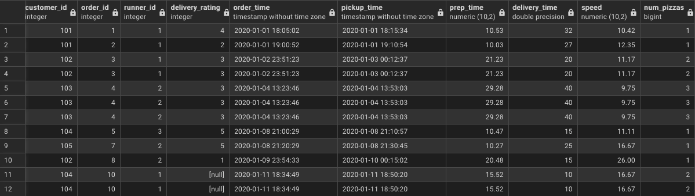

# D. Pricing and Ratings
### 1. If a Meat Lovers pizza costs $12 and Vegetarian costs $10 and there were no charges for changes - how much money has Pizza Runner made so far if there are no delivery fees?
```sql
with eligible_orders as (
	select 
		order_id 
	from 
		pizza_runner.stg_runner_orders where cancellation is null or cancellation = 'Customer Cancellation'
)
select
	sum(
		case
			when pizza_id = 1 then 12
			else 10
		end
	) as total_revenue
from
	stg_customer_orders
where
	order_id in (select * from eligible_orders)
```
|  total_revenue  |
| --------------- |
|       150       |


### 2. What if there was an additional $1 charge for any pizza extras?

    Add cheese is $1 extra
```sql
with eligible_orders as (
	select 
		order_id 
	from 
		pizza_runner.stg_runner_orders where cancellation is null or cancellation = 'Customer Cancellation'
),
num_extras as (
	select
		row_num,
		order_id,
		pizza_id,
		count(*) as cnt
	from
		(
			select
				row_num,
				order_id,
				pizza_id,
				unnest(string_to_array(extras, ', ')) as extras
			from
				stg_customer_orders
		) d
	group by
		1, 2, 3
)
select
	sum(
		case
			when o.pizza_id = 1 then 12 + coalesce(e.cnt, 0)
			else 10 + coalesce(e.cnt, 0)
		end
	)
from
	stg_customer_orders o
left join
	num_extras e on
	e.order_id = o.order_id and
	e.pizza_id = o.pizza_id and
	o.row_num = e.row_num
where
	o.order_id in (select * from eligible_orders)
```
|  total_revenue  |
| --------------- |
|       156       |


### 3. The Pizza Runner team now wants to add an additional ratings system that allows customers to rate their runner, how would you design an additional table for this new dataset - generate a schema for this new table and insert your own data for ratings for each successful customer order between 1 to 5.
```sql
DROP TABLE IF EXISTS stg_runner_ratings;

CREATE TABLE stg_runner_ratings (
	order_id INTEGER,
	runner_id INTEGER,
	rating INTEGER CHECK(rating <= 5 AND rating >= 1)
);

INSERT INTO stg_runner_ratings (order_id, runner_id, rating) VALUES
  (1, 1, 4),
  (2, 1, 2),
  (3, 1, 3),
  (4, 2, 3),
  (5, 3, 5),
  (7, 2, 5),
  (8, 2, 1),
  (10, 1, NULL);
```


### 4. Using your newly generated table - can you join all of the information together to form a table which has the following information for successful deliveries?

    customer_id
    order_id
    runner_id
    rating
    order_time
    pickup_time
    Time between order and pickup
    Delivery duration
    Average speed
    Total number of pizzas

```sql
select
    c.customer_id,
    c.order_id,
    r.runner_id,
    rr.rating as delivery_rating,
    c.order_time,
    r.pickup_time,
    cast (extract(epoch from (r.pickup_time - c.order_time)) / 60.0 as numeric(10, 2))as prep_time,
    r.duration as delivery_time,
    cast((r.distance * 1000.0) / (r.duration * 60.0) as numeric(10, 2)) as speed,
	count(c.pizza_id) over(partition by c.order_id) as num_pizzas
from
    stg_customer_orders c
join
    stg_runner_orders r on
    r.order_id = c.order_id
join
    stg_runner_ratings rr on
    rr.order_id = c.order_id and
    rr.runner_id = r.runner_id
order by
	order_id
```




### 5. If a Meat Lovers pizza was $12 and Vegetarian $10 fixed prices with no cost for extras and each runner is paid $0.30 per kilometre traveled - how much money does Pizza Runner have left over after these deliveries?

```sql
select
	sum(
		case
			when pizza_id = 1 then 12
			else 10
		end
		) - ((select sum(distance) from stg_runner_orders where cancellation is null) * 0.30) as after_delivery
from
    stg_customer_orders
where
	order_id in (select order_id from stg_runner_orders where cancellation is null or cancellation = 'Customer Cancelled')
```
|  after_delivery  |
| ---------------- |
|      94.44       |