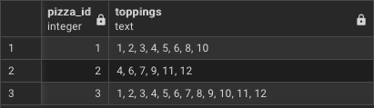

# Bonus Question
### If Danny wants to expand his range of pizzas - how would this impact the existing data design? Write an INSERT statement to demonstrate what would happen if a new Supreme pizza with all the toppings was added to the Pizza Runner menu?
```sql
insert into pizza_names values(3, 'Supreme');
insert into pizza_runner.pizza_recipes values(
	3, (select string_agg(cast(topping_id as text), ', ') from pizza_runner.pizza_toppings)
);
select * from pizza_runner.pizza_recipes;
```

